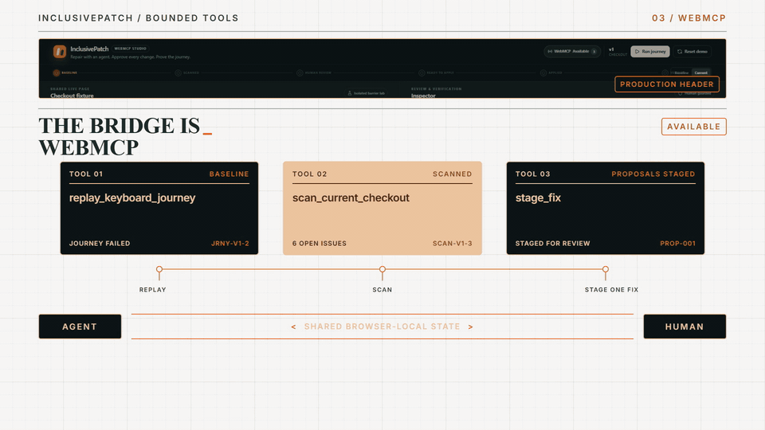
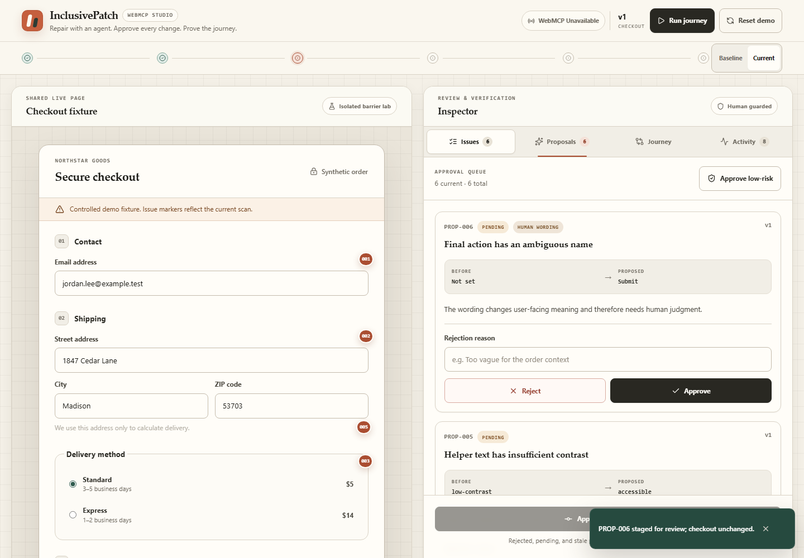
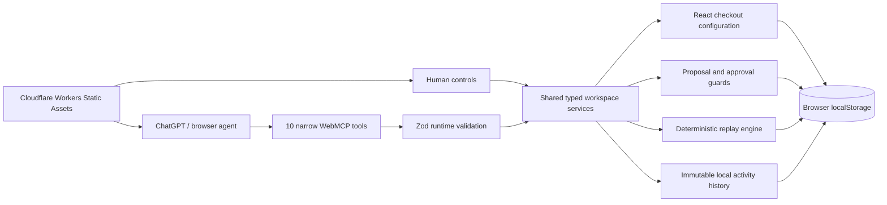

# InclusivePatch

> Repair accessibility barriers with an agent, approve every change, and prove the keyboard journey works.

[](https://github.com/1aifanatic/inclusivepatch-webmcp-challenge/actions/workflows/ci.yml)
[](LICENSE)
[](https://inclusivepatch.aiconic-innovations.workers.dev)

**Live application:** <https://inclusivepatch.aiconic-innovations.workers.dev>

**Public source:** <https://github.com/1aifanatic/inclusivepatch-webmcp-challenge>

**Demo video:** [Watch or download the 2:24 narrated walkthrough](https://github.com/1aifanatic/inclusivepatch-webmcp-challenge/releases/latest/download/inclusivepatch-demo.mp4)

**30-second demo:** scan the checkout, stage six bounded remediations, and keep the user-facing wording decision human-controlled.



**Current interface:** a judge-ready walkthrough, warm editorial surfaces, accessible clay-and-forest state colors, and a responsive two-panel review workspace.



InclusivePatch is a WebMCP-powered accessibility remediation workspace where a developer and ChatGPT repair a deliberately broken checkout together. The app exposes narrow site tools for scanning, inspecting evidence, staging bounded remediations, applying only current-version human approvals, replaying a deterministic keyboard journey, and exporting an auditable patch manifest.

The checkout and all customer details are synthetic. InclusivePatch is a focused demonstration, not an accessibility certification product.

## Why this needs WebMCP

Traditional scanners stop at findings. InclusivePatch keeps the finding, proposed fix, human decision, applied configuration, replay evidence, and exported audit record in one visible page state. The agent operates that same state through `document.modelContext.registerTool`; there is no embedded chatbot, OpenAI API call, arbitrary DOM mutation tool, or hidden server workflow.

The critical collaboration moment is deliberately human-controlled: a technically accessible but contextually weak final-action label can be rejected, revised, approved, and traced. The rejected value is never applied.

## Golden workflow

1. Run the clean baseline keyboard journey and record its deterministic failures.
2. Scan the current fixture; exactly six planted findings appear.
3. Inspect evidence and permitted fix options.
4. Stage proposals without changing the checkout.
5. Reject the weak `Submit` action name with a reason.
6. Stage `Review and place order` as a linked revision.
7. Approve the current proposals and apply only those IDs.
8. Replay all 11 keyboard assertions and reach `VERIFIED`.
9. Compare baseline and current versions, then export JSON or Markdown evidence.

Golden prompt:

> Make this checkout completeable by keyboard without changing its visual design. Stage every remediation for review, replay the full checkout journey after approved changes are applied, and ask me to resolve any user-facing wording that requires human judgment.

## Architecture



- React + TypeScript + Vite
- Cloudflare Vite plugin and Workers Static Assets SPA routing
- axe-core adapter plus deterministic project-specific probes
- Typed reversible patch catalog; no raw selector, HTML, JavaScript, or `eval` input
- Browser-only state and exports; no database, authentication, analytics, or external API
- Phase-aware registration with `AbortSignal` cleanup and cancellation-aware replay

## Site tools

| Tool | Side effect | Purpose |
| --- | --- | --- |
| `get_workspace_state` | Read only | Return phase, version, findings, proposals, selection, and journey state. |
| `scan_current_checkout` | Records scan | Run axe-supported and custom deterministic probes. |
| `get_issue_details` | Read only | Return evidence and the affected stable component. |
| `get_fix_options` | Read only | Return only predefined options belonging to one issue. |
| `stage_fix` | Stages only | Create a proposal without changing checkout configuration. |
| `apply_approved_fixes` | Mutates config | Apply selected, approved, current-version proposals only. |
| `replay_keyboard_journey` | Records replay | Run 11 in-page assertions with cancellation support. |
| `compare_versions` | Read only | Compare explicit baseline/current issues, proposals, and journey outcomes. |
| `undo_last_applied_fix` | Mutates config | Restore the previous typed configuration and invalidate verification. |
| `export_patch_manifest` | Local download | Generate JSON or Markdown evidence in the browser. |

Tools dynamically register for the current workspace phase. Read-only annotations are used only for functions that do not modify application state; human- or agent-entered text is marked as untrusted content where appropriate.

## Run locally

Requirements: Node.js 22+ and pnpm 9.9+.

```bash
pnpm install
pnpm run dev
```

Open the printed local URL. The complete human interface works in a normal browser when WebMCP is unavailable.

### Test WebMCP

Use ChatGPT's in-app browser or a Chrome build with WebMCP enabled for the current origin-trial/testing setup. Confirm that the header changes from `unavailable` to `available`, then inspect the phase-aware tool count.

The implementation follows the current [Chrome WebMCP Imperative API](https://developer.chrome.com/docs/ai/webmcp/imperative-api), [WebMCP best practices](https://developer.chrome.com/docs/ai/webmcp/best-practices), and [tool security guidance](https://developer.chrome.com/docs/ai/webmcp/secure-tools). WebMCP remains experimental, so recheck browser setup immediately before judging.

## Test and build

```bash
pnpm run typecheck   # strict TypeScript, including tests
pnpm run test        # deterministic unit, integration, and 20 eval-contract cases
pnpm run test:e2e    # real Chromium golden flow, reset, downloads, and mocked WebMCP lifecycle
pnpm run test:agent  # optional: 20 isolated model first-tool trials (authenticated Codex CLI)
pnpm run build       # production Cloudflare/Vite output
pnpm run verify      # complete local release gate
pnpm run test:production # headless smoke test of the deployed Worker
```

The automated suite covers all six probes, contrast math, patch apply/undo, approval and stale-version guards, state transitions, manifest contents, 11 replay assertions, 20 WebMCP eval contracts, unavailable/error WebMCP fallbacks, localStorage persistence and reset, cancellation, phase registration, visible tool-driven updates, download generation, and the complete rejection/revision journey. The independent agent sample achieved 20/20 correct phase-aware first-tool selections. The production smoke test also verifies security headers, SPA fallback routing, persistence, undo, reset, and zero browser errors against the public Worker. See [testing details](docs/TESTING.md) and the [agent evaluation record](docs/AGENT_EVALUATION.md).

## Deploy to Cloudflare Workers

The app uses the Cloudflare Vite plugin. `wrangler.jsonc` intentionally omits `assets.directory`; the plugin creates the deployable output config and points it at the client build.

```bash
pnpm run typecheck
pnpm run test
pnpm run test:e2e
pnpm run deploy
```

`assets.not_found_handling` is set to `single-page-application`, so non-asset routes fall back to `index.html`. A direct Wrangler deployment is the recovery path. For Git-connected production, import this public repository in Workers Builds, select `main`, and use `pnpm exec wrangler deploy` as the deploy command.

## Accessibility and privacy boundaries

- The surrounding studio uses landmarks, semantic headings, labeled controls, visible focus, live status messages, reduced-motion support, non-color status text, and responsive layouts.
- The intentionally broken checkout is explicitly isolated. Its keyboard-trap fixture always offers Escape as a safety exit.
- Scans combine axe-supported checks with fixture-specific deterministic probes; they do not represent full WCAG testing.
- All names, addresses, email values, products, and order data are fictional.
- No user data is transmitted. Browser state can be cleared with **Reset demo**.
- Patch exports are created locally. No cookies, accounts, payments, analytics, or cloud storage are used.

## Repository map

```text
src/
├── accessibility/   # axe adapter, issue normalization, contrast math
├── checkout/        # synthetic fixture and typed accessibility config
├── domain/          # state model, invariants, transitions, comparison
├── export/          # JSON and Markdown patch manifests
├── journey/         # deterministic 11-step replay assertions
├── proposals/       # bounded reversible patch catalog
├── state/           # shared human/WebMCP services and local persistence
├── webmcp/          # schemas, definitions, phase lifecycle, browser types
└── workspace/       # checkout and inspector panels
tests/
├── unit/            # pure domain and schema behavior
├── integration/     # rendered no-WebMCP human fallback
├── e2e/             # real Chromium golden flow and WebMCP mock
└── webmcp/          # 20-case evaluation contract
```

## Competition work declaration

InclusivePatch was implemented for the OpenAI WebMCP Challenge during the official submission period beginning August 25, 2026. All InclusivePatch product logic, synthetic checkout fixtures, accessibility probes, remediation workflow, journey replay, approval controls, and interface components in this repository were created for this submission. The project uses official Cloudflare and Chrome WebMCP documentation as implementation references.

Third-party packages and licenses are listed in [THIRD_PARTY_NOTICES.md](THIRD_PARTY_NOTICES.md). Security guidance is in [SECURITY.md](SECURITY.md), and contribution instructions are in [CONTRIBUTING.md](CONTRIBUTING.md).

## License

MIT © 2026 Naveen Chatlapalli. See [LICENSE](LICENSE).
